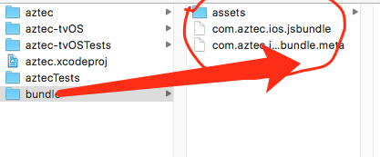
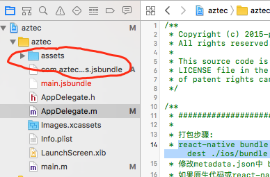

>本文是简单的react-native离线打包教程


# ios打包

## step1： 命令行导出bundle包和图片资源

1. 在`./ios`路径新建`bundle`文件

2. 命令行执行

```
react-native bundle --entry-file index.ios.js --bundle-output ./ios/bundle/com.aztec.ios.jsbundle --platform ios --assets-dest ./ios/bundle --dev false
```
成功后会在`bundle`文件夹生成`bundle`文件和asset文件夹，这些就是我们需要引入project的打包后资源，如图1




## step2:将js bundle包和图片资源导入到iOS项目中

打开XCode，把`assets`文件夹与`com.aztrc.ios..jsbundle`文件拖拽到XCode的项目导航面板中即可,如图2



修改AppDelegate.m文件

原文件

```
- (BOOL)application:(UIApplication *)application didFinishLaunchingWithOptions:(NSDictionary *)launchOptions
{
  NSURL *jsCodeLocation;

  jsCodeLocation = [[RCTBundleURLProvider sharedSettings] jsBundleURLForBundleRoot:@"index.ios" fallbackResource:nil];

 ...
 return YES;
}
```

修改后

```
- (BOOL)application:(UIApplication *)application didFinishLaunchingWithOptions:(NSDictionary *)launchOptions
{
  NSURL *jsCodeLocation;
  bool isDevelop = false; //每次打包置成false
  bool isBeta = false;
  
  //develop时使用locaHost
  if (isDevelop) {
    jsCodeLocation = [[RCTBundleURLProvider sharedSettings] jsBundleURLForBundleRoot:@"index.ios" fallbackResource:nil];
  } else{ //正式打包，使用
    jsCodeLocation = [[NSBundle mainBundle] URLForResource:@"com.aztec.ios" withExtension:@"jsbundle"];
  }

 	...
  return YES;
}


```

然后执行安装，或者打包上传


# Android打包

## step1:命令行导出bundle包和图片资源

```
react-native bundle --entry-file index.android.js --bundle-output ./android/app/src/main/assets/com.aztec.android.jsbundle --platform android --assets-dest ./android/app/src/main/res/ --dev false

```


这里跟ios不同，就不要再拷贝 

## step2:修改MainApplication.java

`MainApplication.java`新增debug判断


```
public class MainApplication extends Application implements ReactApplication {

  private  boolean isDebug = true;

  private  ReactNativeHost mReactNativeHost;

  @Override
  public ReactNativeHost getReactNativeHost() {
    return mReactNativeHost;
  }

  @Override
  public void onCreate() {
    super.onCreate();
    isDebug = this.isApkInDebug(this);
    this.createReactNativeHost();
    SoLoader.init(this, /* native exopackage */ false);
  }

  /**
   * 判断当前应用是否是debug状态
   */
  private  boolean isApkInDebug(Context context) {
    try {
      ApplicationInfo info = context.getApplicationInfo();
      return (info.flags & ApplicationInfo.FLAG_DEBUGGABLE) != 0;
    } catch (Exception e) {
      e.printStackTrace();
      return false;
    }
  }

  private void  createReactNativeHost(){
    mReactNativeHost = new ReactNativeHost(this) {

      @Nullable
      @Override
      protected String getBundleAssetName() {
        return "com.aztec.android.jsbundle";
      }

      @Nullable
      @Override
      protected String getJSBundleFile() {
        return null;
      }

      @Override
      public boolean getUseDeveloperSupport() {
        //return BuildConfig.DEBUG;
        return  isDebug;
      }

      @Override
      protected List<ReactPackage> getPackages() {
        return Arrays.<ReactPackage>asList(
                new MainReactPackage(),
                new RNSpinkitPackage(),
                new VectorIconsPackage()
        );
      }


    };
  }
}

```

## step3:执行build-release

生成apk，此时的apk就已经包含了打包后的资源


